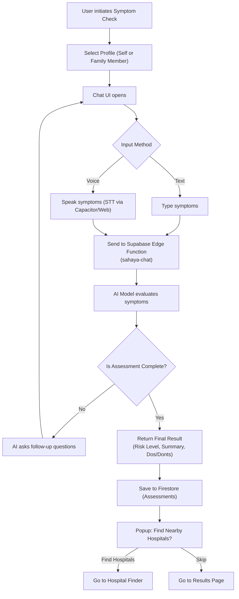
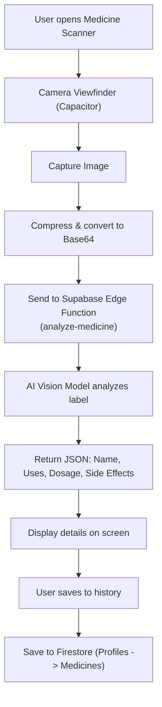
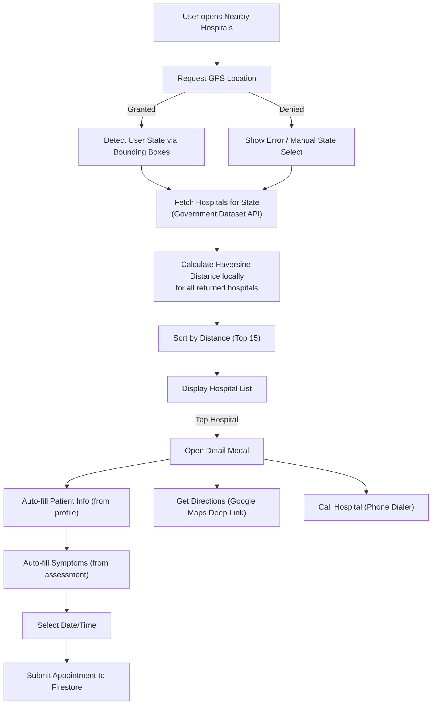
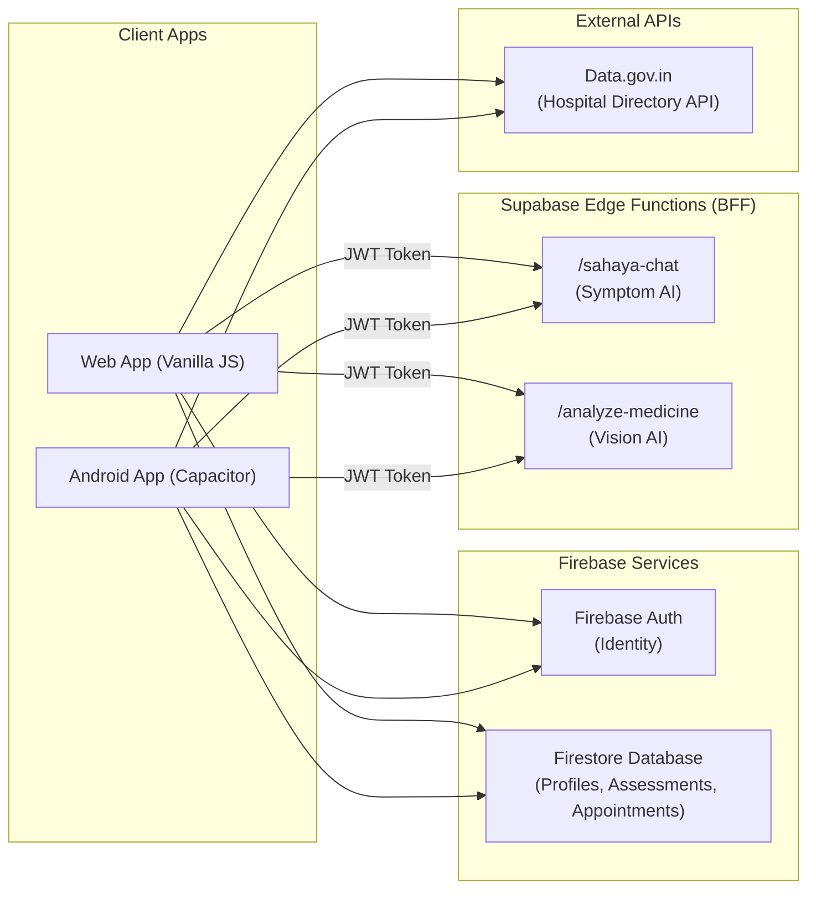

# Sahaya: Existing Architecture & Workflows

This document outlines the current working architecture of the Sahaya AI application, including the major workflows (Symptom Assessment, Medicine Scanner, Hospital Finder) and the overarching system architecture.

## 1. Symptom Assessment Flow

This flowchart describes how users interact with the AI to assess their symptoms, resulting in a risk level and recommendations.

## 2. Medicine Scanner Flow

This flowchart describes how users can scan a medicine label to get AI-generated information about the drug.

## 3. Hospital Finder & Appointment Flow

This flowchart describes the 100% free hospital finding module that uses government data and client-side calculations.

## 4. Final Existing Architecture

This diagram represents the complete, current architecture of Sahaya as it stands today. It uses a Capacitor front-end, Firebase for Identity and Database, and Supabase Edge Functions for secure AI interactions.

