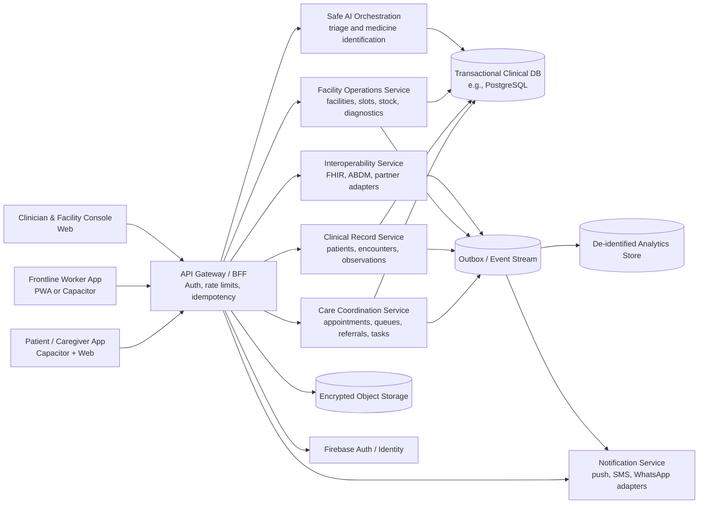

# Sahaya: Future Architecture & Roadmap

This document outlines the target architecture for Sahaya as it scales into a full care-coordination platform. It details how the existing modules will integrate with the future Worker and Hospital Admin modules.

## 1. Target Future Architecture (Logical View)

The future architecture introduces a dedicated backend (e.g., PostgreSQL for relational data), separates clinical workflows into distinct microservices, and adds Interoperability (FHIR/ABDM) and Operations services.

## 2. Upcoming Modules

### A. Hospital Admin Module
This module will provide a web console for facility managers and clinicians to close the loop on patient care.

- **Appointment Management**: View, accept, or reject incoming appointment requests from patients.
- **Queue Management**: Issue token numbers, estimate wait times, and manage live check-ins.
- **Encounter Workspace**: Clinicians can view the AI triage case, add notes, and record human dispositions.
- **Medicine Stock**: Update facility pharmacy stock for accurate patient-facing availability.

### B. Frontline Worker Module
This module equips community health workers with tools to follow up on high-risk patients.

- **Caseload & Tasks**: View a daily assigned dashboard of overdue tasks and high-risk follow-ups.
- **Appointment Follow-up**: 
  - The system marks past appointments as "pending check".
  - Worker calls the patient to confirm attendance.
  - **If attended**: Worker marks complete, removes the task.
  - **If not attended**: Worker records the reason and reschedules if needed.
- **Assisted Registration**: Register patients and conduct triage on their behalf offline.

## 3. Data Migration Path

Currently, Sahaya uses Firestore as its primary database. As the system scales to accommodate the Worker and Hospital modules:
1. **Relational Data**: Move Appointments, Queues, and Referrals to a transactional SQL database (e.g., Supabase Postgres).
2. **Offline Sync**: Implement an event-sourcing or CRDT model to handle offline mutations generated by Frontline Workers in remote areas.
3. **Storage**: Migrate embedded Base64 images to secure, short-lived Object Storage (S3/Firebase Storage).
