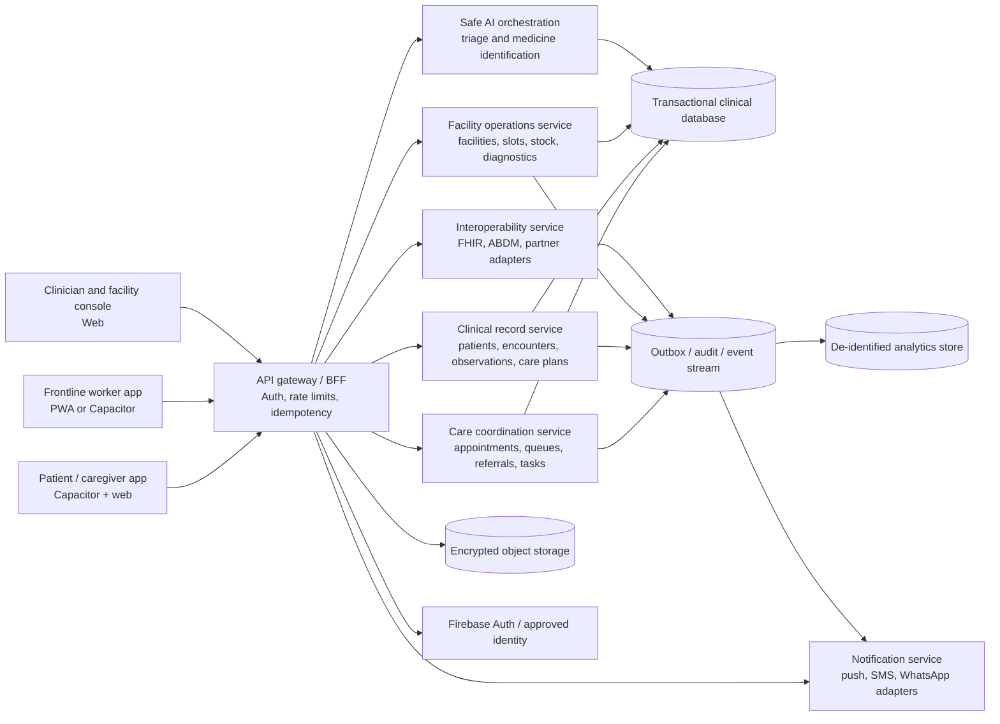

# Sahaya: Feature Roadmap and Target Architecture

## 1. Purpose and current baseline

This document describes the smallest credible path from the present Sahaya app to the expected integrated care-access and quality-support solution. It is an architecture and implementation guide only; it does not change the application code.

The current app is a patient/family-facing Capacitor web app with:

- Firebase authentication and Firestore family profiles.
- Weight and blood-detail history.
- AI symptom conversation with risk output, voice input/output, and saved assessment history.
- Medicine-label image scanning with AI-generated medicine information.
- Multilingual UI selection and Indian-language voice settings.
- PDF assessment reports and offline-capable local app assets.

The current app does **not** yet provide a real clinician or facility workflow. In particular, doctor consultation is a placeholder, and there are no appointment/queue, referral, diagnostic-order, medicine-stock, follow-up-task, facility, or quality-dashboard domains.

## 2. Target product boundary

Sahaya should be treated as a care-coordination platform with three clients sharing one governed clinical data platform:

1. **Community/patient client**: assisted self-service, family profiles, triage, appointments, status updates, records, medicine and diagnostic visibility, reminders, and emergency escalation.
2. **Frontline/clinician client**: assisted registration, encounter workspace, queue control, triage review, consultation, orders, referrals, care plans, and follow-up.
3. **Facility/quality console**: operational queues, service availability, referral completion, high-risk follow-up, stock/diagnostic visibility, and aggregated quality indicators.

The patient client can remain the first delivery surface. The other two clients are essential to the expected outcomes; otherwise the product only reports health information without closing the care loop.

## 3. Recommended feature set

### Priority 0: foundation and trust

These are prerequisites for every later feature:

- **Role-based access**: patient/family caregiver, community health worker, clinician, pharmacist/lab user, facility manager, district quality user, and platform administrator.
- **Consent and privacy**: purpose-based consent, consent history, minimum-necessary access, audit trail, account deletion/export, privacy policy, retention rules, and emergency-access logging.
- **Server-side identity and authorization**: every AI, record, appointment, referral, and facility request must be authorized by a backend using the Firebase ID token. Client-side Firestore checks alone are not sufficient for a multi-role clinical system.
- **Stable clinical identifiers**: internal patient ID, facility ID, encounter ID, and correlation ID. Do not use a display name as an identifier.
- **Reliable notifications**: in-app notification first, then SMS/WhatsApp/push adapters where consent and local policy permit.
- **Offline operation**: local encrypted queue, explicit sync state, retry/backoff, conflict resolution, and a clear last-synced timestamp.

### Priority 1: care access and digital triage

These features produce the fastest visible improvement in travel and waiting time:

- **Facility directory**: facility type, services, hours, language support, accessibility, location, contact, current service availability, and last-updated time.
- **Appointment request and slot management**: choose facility/service/provider, request or book a slot, reschedule/cancel, reminders, no-show status, and walk-in registration.
- **Queue management**: token number, estimated wait, check-in, triage priority, called/in-service/completed states, and staff override with audit reason.
- **Assisted registration**: a frontline worker can create/update a patient record with consent and can operate on behalf of a patient without becoming the data owner.
- **Structured triage**: retain the conversational assistant, but make the output a reviewable triage case with symptoms, onset, vital signs, red flags, urgency, recommended service, confidence, model/version, and human disposition.
- **Emergency escalation**: red-flag rules must bypass normal AI advice, show local emergency instructions, optionally call a configured emergency number, notify an assigned worker, and record acknowledgement/escalation status.

### Priority 2: longitudinal record and care coordination

- **Patient timeline**: encounters, symptoms, vitals, allergies, conditions, medications, diagnoses, investigations, referrals, appointments, and follow-up tasks in chronological order.
- **Encounter workspace**: clinician notes, assessment, diagnosis, care plan, patient instructions, attachments, and signed/closed status.
- **Referral tracking**: referral reason, originating facility, destination, urgency, appointment, acceptance, scheduled, attended, report received, closed, and failed-to-complete reasons.
- **Diagnostic coordination**: order/request, test catalog, collection status, lab status, result, abnormal flag, clinician acknowledgement, and patient notification. The system should track the result workflow rather than interpret results autonomously.
- **Medicine availability**: facility pharmacy stock, item/strength/form, available quantity band, last verified time, substitution/escalation contact, and reservation/dispense status. The existing image scanner should become an identification aid, never a source of prescribing authority.
- **Care plans and tasks**: owner, due date, recurrence, priority, completion evidence, missed-task reason, and escalation rules.

### Priority 3: high-risk and population support

- **Risk registry**: maternal, newborn/child, chronic disease, elderly, disability, and other locally configured cohorts.
- **Scheduled follow-up**: next contact date, channel, assigned worker, checklist, missed-contact escalation, and outcome.
- **Remote monitoring**: optional patient-entered or device-imported observations with threshold rules and human review queues.
- **Family/caregiver permissions**: granular access to a dependent's record, with the dependent's consent model represented explicitly where applicable.
- **Quality dashboard**: operational and clinical process metrics by facility, service, geography, date range, and cohort, with suppression/minimum-count rules for privacy.

### Priority 4: interoperability and scale

- **FHIR R4-aligned exchange boundary**: map internal records to Patient, RelatedPerson, Encounter, Observation, Condition, AllergyIntolerance, MedicationRequest, MedicationDispense, ServiceRequest, DiagnosticReport, CarePlan, Appointment, Schedule, Slot, Task, ReferralRequest/ServiceRequest, Organization, Practitioner, and Provenance as appropriate.
- **India/ABDM readiness where applicable**: keep ABHA and consent artifacts optional and separate from the internal patient key; integrate only after the required sandbox, consent, security, and organizational approvals are in place.
- **Terminology service**: versioned mappings for local terms to approved codes such as LOINC for observations and ICD/SNOMED-compatible diagnosis terminology according to the deployment's licensing and policy constraints.
- **External adapters**: SMS, WhatsApp, teleconsultation/video, lab systems, pharmacy systems, facility registries, and approved health-information exchanges behind adapters rather than embedded in screens.

## 4. Target architecture

### 4.1 Logical view

### 4.2 Deployment recommendation

**Near term:** retain the existing Vanilla HTML/JS and Capacitor clients. Add a single backend API/BFF and move all privileged operations behind it. Firebase Auth can remain the identity provider, and Firestore can remain the first persistence layer only if rules, transactions, query patterns, and audit requirements are proven adequate.

**Recommended medium-term shape:** use a relational transactional store such as PostgreSQL for appointments, queues, referrals, diagnostics, inventory, tasks, and reporting dimensions. Keep Firestore for a compatibility/read-model transition if needed, but establish one authoritative owner for each entity. Use encrypted object storage for photos, reports, and diagnostic documents rather than embedding large base64 values in profile documents.

**AI boundary:** consolidate the two current Supabase Edge Function routes behind one authenticated AI service. The service should receive a patient/encounter reference, not arbitrary client-supplied clinical authority; fetch permitted context server-side; validate structured output; apply deterministic red-flag rules; log model/version and latency; and require human review for clinical action.

**Offline boundary:** the client stores only the minimum working set locally. Mutations become signed/idempotent commands with a client-generated operation ID. The server returns accepted, rejected, or needs-review status. Clinical conflicts are resolved by preserving both versions and requiring a worker/clinician decision; silent last-write-wins is unsafe for notes, results, referrals, and medication data.

## 5. Core domain model

The following entities should be designed before adding screens:

| Entity | Ownership and purpose | Key fields |
|---|---|---|
| `User` | Authenticated account | `userId`, roles, contact, status |
| `Patient` | Person receiving care | `patientId`, demographics, identifiers, preferred language, accessibility needs |
| `CaregiverAccess` | Delegated family access | `patientId`, `userId`, relationship, scopes, consent, expiry |
| `Facility` | Place providing care | `facilityId`, organization, location, services, hours, status |
| `Provider` | Worker or clinician | `providerId`, role, facility memberships, specialties, status |
| `Encounter` | A care interaction | `encounterId`, patient, facility, participants, type, start/end, status |
| `TriageCase` | Structured screening and disposition | red flags, urgency, symptoms, observations, AI metadata, human decision |
| `Appointment` | Planned access event | patient, service, slot, status, channel, reminder state |
| `QueueTicket` | Real-time facility waiting state | encounter/appointment, token, priority, status, timestamps |
| `Observation` | A measured or reported value | code, value, unit, effective time, source, performer, reference range |
| `Condition` | Problem/diagnosis | code, onset, status, verification, encounter |
| `Medication` | Medication concept/product | code, strength, form, instructions, source |
| `MedicationRequest` | Clinical order/prescription | requester, intent, dosage, duration, status |
| `InventoryItem` | Facility stock visibility | facility, medication/product, quantity band, expiry band, verified time |
| `ServiceRequest` | Referral or diagnostic order | type, priority, requester, performer, destination, status |
| `DiagnosticReport` | Result package | order, observations, report status, abnormal flags, acknowledgement |
| `CarePlan` | Longitudinal goals and interventions | goals, activities, owner, review date, status |
| `FollowUpTask` | Action assigned to a worker | owner, due date, recurrence, escalation, evidence, status |
| `Consent` | Permission for use/share | purpose, scope, actor, timestamp, expiry, revocation |
| `AuditEvent` | Immutable access/change record | actor, action, entity, reason, timestamp, correlation ID |

Every clinical entity should carry `createdAt`, `updatedAt`, `createdBy`, `source`, `facilityId` where relevant, and a version/concurrency field. Deletion should generally be a governed status change or redaction workflow, not an uncontrolled hard delete.

## 6. Key workflows

### 6.1 Triage to consultation

1. Patient or worker starts a symptom case in the selected language.
2. The assistant gathers structured answers and vitals; the backend runs deterministic red-flag checks before/alongside the model.
3. The system creates a `TriageCase` and shows the explanation, urgency, limitations, and next action.
4. Low-risk cases receive self-care and a monitoring task; moderate cases receive an appointment/queue option; high-risk cases trigger emergency escalation and worker notification.
5. A clinician can accept, modify, or reject the AI disposition. The human disposition is the care decision of record.
6. The resulting `Encounter`, observations, plan, and follow-up task appear in the patient timeline.

### 6.2 Referral completion

1. A clinician creates a referral with reason, urgency, destination, and needed service.
2. The receiving facility accepts or rejects it and proposes a slot.
3. The patient/worker sees status and travel-relevant information.
4. Attendance and diagnostic/report receipt update the referral.
5. Missed or stalled states create tasks and escalation; completion is measured only when the receiving report or documented outcome arrives.

### 6.3 Diagnostic and medicine availability

1. A clinician creates a coded diagnostic request or medication request.
2. The system checks the selected facility's last-verified availability and displays uncertainty explicitly.
3. A lab/pharmacy user updates collection, result, stock, dispense, or substitution status.
4. The patient receives a localized notification; abnormal results require clinician acknowledgement before being marked reviewed.

### 6.4 High-risk follow-up

1. Rules identify a cohort from consented, coded clinical data.
2. The system creates a recurring `FollowUpTask` assigned to a worker/facility.
3. The worker records contact attempt, symptoms, observations, barriers, and outcome offline if necessary.
4. Missed contacts escalate by policy; the dashboard counts overdue tasks and completion, not just enrollment.

## 7. Security, safety, and governance requirements

- Enforce authorization server-side by user, patient relationship, facility, role, and purpose of use.
- Use Firestore security rules and backend authorization together during migration; never rely on a client-side `userId` field as proof of ownership.
- Send Firebase ID tokens to the backend over TLS; verify issuer, audience, expiry, and revocation policy.
- Store health data encrypted in transit and at rest. Keep photos/reports in object storage with short-lived authorized URLs.
- Add immutable audit events for record access, export, sharing, clinical changes, emergency override, and AI use.
- Separate identifiable clinical data from analytics. Apply aggregation, access control, retention, and small-cell suppression to dashboards.
- Treat AI as decision support. Validate schemas, reject unsupported outputs, display uncertainty, preserve prompts/results according to policy, and require human review for diagnosis, prescribing, emergency disposition, and abnormal-result closure.
- Add abuse controls: per-user/facility rate limits, quotas, replay protection, payload limits, malware scanning for uploads, and alerting for anomalous access.
- Provide accessible, language-aware consent and emergency messaging. Translation must not alter medication dose, warning, or urgency without a reviewable source string.
- Define clinical governance with a named medical owner, escalation policy, model change review, incident process, and rollback procedure.

## 8. Delivery sequence

### Phase A: make the current foundation extensible

- Write the role/permission matrix and patient/facility ownership rules.
- Consolidate the AI endpoints behind one authenticated backend.
- Introduce a backend API contract, correlation IDs, audit events, and server-side validation.
- Replace profile-embedded base64 photos with object-storage references.
- Define canonical patient, facility, encounter, observation, and task IDs.
- Replace widget-only translation with versioned string tables for all user-visible and dynamic content; keep language/voice preferences on the user profile.

**Exit condition:** every existing feature is authenticated, attributable to a patient/profile, auditable, rate-limited, and usable with an explicit offline/sync state.

### Phase B: deliver access improvement

- Facility/service directory.
- Appointment request and reminders.
- Facility queue and patient token status.
- Structured triage case and emergency escalation.
- Worker-assisted registration and clinician review.

**Exit condition:** a patient can move from symptom intake to a booked or queued service, and staff can close the encounter with recorded disposition.

### Phase C: close the care loop

- Patient timeline and encounter notes.
- Referral lifecycle and completion tracking.
- Diagnostic orders/results and acknowledgement.
- Medicine stock verification and dispense status.
- Care plans and follow-up tasks.

**Exit condition:** a referred patient, ordered diagnostic, or prescribed medicine has a visible lifecycle ending in completion, failure reason, or documented alternative.

### Phase D: improve population follow-up and quality

- Configurable high-risk cohorts and recurring tasks.
- Worker caseload and overdue follow-up views.
- Facility dashboards and quality indicators.
- De-identified analytics and exportable reports.
- FHIR/ABDM and partner adapters after the internal workflows are stable.

**Exit condition:** managers can identify service bottlenecks and overdue high-risk care without exposing unnecessary patient detail.

## 9. Suggested success measures

Measure a baseline before rollout and compare by facility and cohort:

- Median travel time avoided and waiting time from check-in to service start.
- Time from symptom intake to first human review.
- Percentage of triage cases with completed disposition.
- Referral acceptance, appointment attendance, and report-received rates.
- Diagnostic result acknowledgement time.
- Percentage of requested medicines with recently verified availability.
- Maternal, child, and chronic follow-up completion and overdue-task rates.
- Emergency escalation acknowledgement time and false-negative/false-escalation review rate.
- Offline mutation success rate, sync latency, and conflict rate.
- Language usage, voice completion rate, accessibility errors, and patient/worker satisfaction.

Do not use AI response count, page views, or number of registered profiles as substitutes for care outcomes.

## 10. What should remain out of scope initially

- Autonomous diagnosis or prescribing.
- A public marketplace of unverified doctors, medicines, or facilities.
- Storing a complete medical record in browser local storage.
- Direct integration with every external health system before the internal event model is stable.
- A dashboard that exposes identifiable patient data by default.
- Teleconsultation video as the first dependency: start with appointment, queue, clinician review, and asynchronous escalation; add video through an adapter once consent, connectivity, and support operations are ready.
